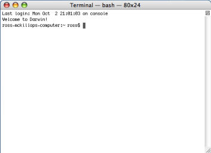

## Getting to the command line

### OSX

If you're using OSX:

1\. Click the Finder button (the magnifying glass) in the top right of your desktop.  
2\. Type "Terminal" into the bar that appears.   
3\. Select the first item that appears in the list.  
4\. The terminal will look like this:  



When you see the `$`, you're in the right place.

Bonus points: if you really want to get the groove of just typing instead of pointing and clicking, you can press "Command (⌘)" and the space bar at the same time to pull up Spotlight search, start typing "Terminal," and then hit "Enter" to open a terminal window. This will pull up a terminal window without touching your mousepad. For super bonus points, try to navigate like this for the next fifteen minutes, or even the rest of this session--it is tricky and sometimes a bit tiring when you start, but you can really pick up speed when you practice!

### Windows

We won't be using Windows's own, non-UNIX version of the command line. Follow these steps to install Git Bash, which we will use in this session:

1\. Download [Git for Windows](https://git-for-windows.github.io/) and install it. You'll be asked a bunch of questions but the defaults are fine.
2\. Click the Windows button on the bottom left of your desktop (or hit the Windows button on your keyboard).  
3\. In Programs, open the Git folder.  
4\. Select "Git Bash." (Not "Git GUI.")  
5\. If you can't find the git folder, just type "git bash" in the search box and select "git bash" when it appears.  
6\. You know you're in the right place when you see the `$`.  

In the next section, we'll learn how to navigate the filesystem in the command line.

## Showing and doing: the very basics

### Showing

Before we get into files, folders, directories, oh my, one of the basic ways to use the command line is to have it show you information. 

Go ahead and open your command line window. You'll see a prompt that looks like this:

```
$
```
In front of the `$`, go ahead and type: `cal`, then hit "Enter."

You should see a calendar! See? Information your computer has, that you've requested to see. 

Also fun: try `uptime` to see how long your computer has been on. 

### Doing

An important thing to remember is that when you type a command and hit enter, it *WILL* cause something to happen on your computer. The terminal is not just a little window that contains these commands--it is the portal to speaking directly with your computer. Perhaps even literally!

In your terminal, go ahead and type:
```
say "welcome to the g c d r i"
```
Woah! See? The command line makes things *happen.* This is great, but if you make a mistake, it can make things happen too, which isn't so great. To avoid this, my second point:

#### ...so go slow at first, and check your spelling!

Yes, it's true! One of the biggest things you can do to make sure your code runs correctly and you can use the command line successfully is to make sure you check your spelling! Keep this in mind today, this week, and your whole life. If at first something doesn't work, your spelling will be the first thing you check. 

OK, caveats aside: let's get going and get into some file navigation!


[<<< Back](what-is-the-command-line.md) - [Next >>>](navigation.md)
