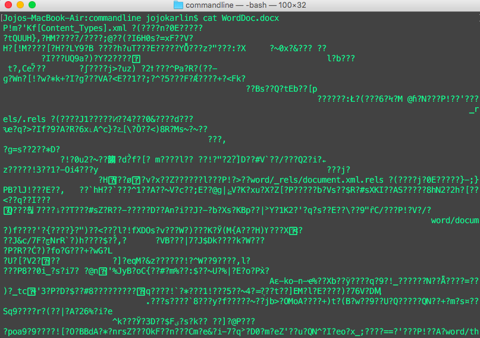
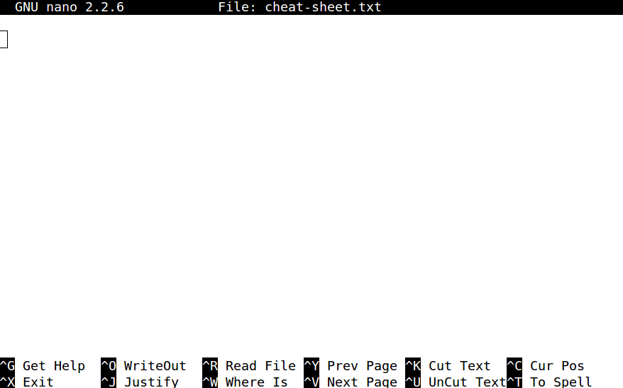

## Text Editors 

### What is Text 

Before we explain which program we'll be using for editing text, we want to give a general sense of this "text" we keep mentioning. For those of us in the humanities, whether we follow literary theorists who read any object as a "text" or we dive into philology, paleography, codicology or any of the fields [David Greetham](https://en.wikipedia.org/wiki/David_Greetham_(textual_scholar)) lays out in *Textual Scholarship*, "text" has its specific meanings. As humanities scholars working with computers, we need to be aware of the ways plain text and formatted text differ. Words on a screen may have hidden formatting. Many of us grew up using Microsoft Word and don't realize how much is going on behind the words shown on the screen. For the purposes of communicating with the computer and for easier movement between different programs, we need to use text without hidden formatting.

This Word .docx file will look something like this

if you ask the commandline to read that file. Word documents which look like "just words!" are actually comprised of extensible markup language (XML) instructions which basically only Microsoft Word can read. Plaintext files can be opened in a number of different editors and can be read within the command line.

## Text Editors

An important tool for programming and working in the command line is a text editor. A text editor is a program that allows you to edit plain text files, such as .txt, .csv, or .md. Text editors are not used to edit rich text documents, such as .docx or .rtf, and rich text editors should not be used to edit plain text files. This is because rich text editors will add many invisible special characters that will prevent programs from running and configuration files from being read correctly. 

While it doesn't really matter which text editor you choose, you should try to become comfortable with at least one text editor. 

### Default Recommendation

Choosing a text editor has as much to do with personality as it does with functionality. For our workshops, we will be using [Visual Studio Code](https://code.visualstudio.com/). Not only is Visual Studio Code free and open source, but it is also consistent across OSX, Windows, and Linux systems.

Take a moment to download now. We won't be using the editor a lot in this tutorial, so don't worry about opening the program now.

Return to [Command Line tutorial](what-is-the-command-line.md)

### More Information about Text Editors

### Editors vs. IDEs

When it comes to editing text and writing code, you can use either a text editor or an IDE (Integrated Development Environment). Text editors tend to be more lightweight solutions, while IDEs try to provide a lot of features to help you write code and tend to target specific languages. There are a lot of exceptions to that description, but the distinction isn't that important. Just know that editors will sometimes describe themselves as IDEs, and that there's a slight difference in philosophy between them.

### Which Text Editor Should I Choose?

#### OSX

- [Textwrangler](http://www.barebones.com/products/textwrangler/) - Simple graphical text editor that is easy to use. If you're used to the Mac way of doing things, TextWrangler should make sense to you. One potential disadvantage is that Textwrangler won't do things like automatically indent Python code.

- [nano](https://www.nano-editor.org/) - GNU nano is a text editor that comes pre-installed in the OSX terminal. nano runs within your terminal window and can be surprising if you aren't aware of its presence. For some operations (say you forget to write a commit message in git), nano will open so that you can insert text. 

If in your terminal you type:

	nano filename.txt

You will open the nano editor in the command line. You'll see your terminal change to look something like this:

When you're done typing to add text to the file, you can save the file by performing these three actions:

1. Hold control and press x.
2. When it asks if you want to save, press <y> for "yes."
2. You'll see the path to the file in the bar. Press <enter> to confirm and your window will resume its command line identity.

### Platform Independent

- [Atom](https://flight-manual.atom.io/getting-started/sections/why-atom/) - Atom is a git and GitHub focused editor. It has advantages if you decide to work a lot with GitHub tools like [GitBooks](https://www.gitbook.com/) and [GitHub Pages](https://pages.github.com/).

#### Fully Customized

- [EMACS](https://www.gnu.org/software/emacs/) - If you are the sort of person who wants full control of your computer's functions, who seeks the power of ORG mode, and who wishes to learn keyboard shortcuts that work across functions, GNU Emacs is the software for you. EMACS requires a fair amount of set-up, but the payoff is that you wind up with the set-up that suits your work habits.

#### Integrated Development Environment [IDE]

As mentioned agove, IDEs offer more functions for testing code and running programs. Depending on the amount and type of programming you are doing, an IDE might be overkill. The [IDE Index](http://pypl.github.io/IDE.html) shows relative popularity of editors and IDEs based on search frequency.

- **[IDLE]()https://docs.python.org/2/library/idle.html** - The default Python IDE that comes bundled with every download of Python. Simple to use and good for beginners to Python. Not very polished and lacks advanced features.
- **Spyder** and **PyCharm** - These are Python-specific IDEs. They have more bells and whistles than a standard text editor like Textwrangler, but they're meant specifically for working with Python. Spyder is free and comes bundled with Anaconda. PyCharm is not free, but some people prefer it for working with Python on the web. 

[<<< Previous](creating_a_cheat_sheet.md) - [Next >>>](grep.md)